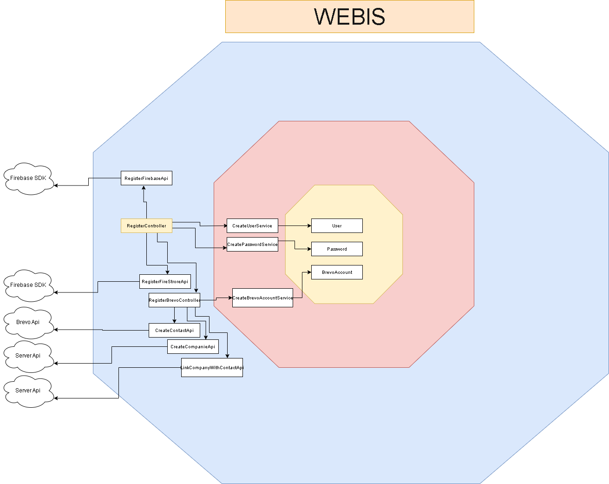

# Webis (APP Ionic, ReactJS)

Proyecto de APP con Ionic/React, para móviles. Esta app era un proyecto experimental para llevar la inteligencia artificial de manera sencilla e intuitiva a cada smartphone, con conexión a diferentes microservicios o APIs (también en mi repositorio), entre ellos: servicios de CRM para manejar diferentes clientes/usuarios, conversión de voz a texto para envío de correos, identificación de texto en imágenes y fotos y conversión de ésos textos a digital (usando servicio de Textract de AWS), chat de inteligencia artificial (texto y voz), entre otros servicios (inherentes a los CRM).

## Instalar el repositorio

Descarga el repositorio. Luego, para seguir con la siguiente parte de la instalacion abre git bash en la carpeta `app-ionic-react`
o tipea:

```
	cd app-ionic-react
```
## Instalar el proyecto

Se necesita tener instalado npm y node la versión mínima 18.16.0.

Abre la consola git bash dentro de la carpeta app-ionic-react.

Si es la primera vez que abres el proyecto tipea 
``` 
npm install
```
para instalar las dependencias

Luego si deseas correr el proyecto en la web
```
ionic serve
```

Luego si deseas correr el proyecto en android
```
ionic build
```
```
ionic capacitor add android
```
```
npx cap sync
```
```
ionic capacitor build android
```
se abrira el android studio y podras utiliza el codigo en el dispositivo que configures


Luego si deseas correr el proyecto en ios
```
ionic capacitor add ios
```
```
cd ios

```
```
cd App

```
```
pod install
```

Realizar Cada vez que se actualice el código  (Desde la ruta del proyecto inicial
)

```
npm run build

```
```
npx cap sync

```
```
ionic capacitor copy ios

```
Abrir el excode y dar click en play, arriba a la izquierda


Luego si deseas correr los tests:
```
npm run test
```

# API Consideraciones

### carpeta src/tests
Contiene todas las pruebas unitarias que se implementaron con Jest para el uso de los CRM

### carpeta src/hooks
Contiene las funciones que activan la cámara y la galería del smartphone.

### carpeta src/chat
Contiene los archivos relacionados al chat con la inteligencia artificial

### carpeta src/pages
Contiene las páginas de login, menu general, uso del servicio Textract de AWS, y todas las funciones relacionadas a los CRM.

### carpeta /documentacion
se encuentra parte de la documentación de hubspot que se necesitó en su momento, cuando se trabajaba con ese CRM.


# API Reference

## Auth

### Register(Firebase)

```http
  SDK firebaseConfig.auth().createUserWithEmailAndPassword(email,password)
```

| Parameter | Type     | Description                |
| :-------- | :------- | :------------------------- |
| `email` | `string` | **Required**. |
| `password` | `string` | **Required**.|

### Register(Firestore)

```http
  SDK firebaseConfig.firestore().collection('users').doc(user.email).set(data)
```

| Parameter | Type     | Description                |
| :-------- | :------- | :------------------------- |
| `data` | `array` | **Required**. Data user|

### Login(Firebase)

```http
  SDK firebaseConfig.auth().signInWithEmailAndPassword(email, password)
```

| Parameter | Type     | Description                |
| :-------- | :------- | :------------------------- |
| `email` | `string` | **Required**. |
| `password` | `string` | **Required**.|

### Login Gmail(Firebase)

```http
  SDK GoogleAuth.signIn();
```

| Parameter | Type     | Description                |
| :-------- | :------- | :------------------------- |

### Delete Data(Firestore)

```http
  SDK firebaseConfig.firestore().collection('users').doc(email).delete()
```

| Parameter | Type     | Description                |
| :-------- | :------- | :------------------------- |
| `email` | `string` | **Required**. |


## Users

### Get User Data

```http
  SDK firebaseConfig.firestore().collection('users').doc(email);
```

| Parameter | Type     | Description                |
| :-------- | :------- | :------------------------- |
| `email` | `string` | **Required**. User email |


## Brevo

### Create Contact

```http
  POST https://api.brevo.com/v3/contacts
```

| Parameter | Type     | Description                |
| :-------- | :------- | :------------------------- |
| `email` | `string` | **Required**. contact email |
| `emailBlacklisted` | `bool` | **Required**.|
| `smsBlacklisted` | `bool` | **Required**.|
| `listIds` | `Array` | **Required**.|
| `updateEnabled` | `bool` | **Required**.|
| `smtpBlacklistSender` | `array` | **Required**.|

### Create Company

```http
  POST https://xxxxxxxxxxxx/CreateCompanieService
```

| Parameter | Type     | Description                |
| :-------- | :------- | :------------------------- |
| `token` | `string` | **Required**. Api Key |
| `name` | `string` | **Required**. Company Name|

### Linky Contact With Company 

```http
  POST https://xxxxxxxxxxxxxxx/api/SendEmailController/LinkCompanyWithContactService
```

| Parameter | Type     | Description                |
| :-------- | :------- | :------------------------- |
| `token` | `string` | **Required**. Api Key |
| `contactId` | `string` | **Required**. Contact Id|
| `companyId` | `string` | **Required**. Company Id|

### Delete Contact 

```http
  POST https://xxxxxxxxxxxxxx/api/SendEmailController/DeleteAContact
```

| Parameter | Type     | Description                |
| :-------- | :------- | :------------------------- |
| `token` | `string` | **Required**. Api Key |
| `email` | `string` | **Required**. Contact Email|


### Delete Company 

```http
  POST https://xxxxxxxxxxxxx/api/SendEmailController/DeleteACompany
```

| Parameter | Type     | Description                |
| :-------- | :------- | :------------------------- |
| `token` | `string` | **Required**. Api Key |
| `id` | `string` | **Required**. Company Id|


# Arquitectura



[Para una mejor vista haz click en este enlace](https://drive.google.com/file/d/1vANZ30fXuhugnQODAwjClrAQybqSAJZR/view?usp=sharing)
